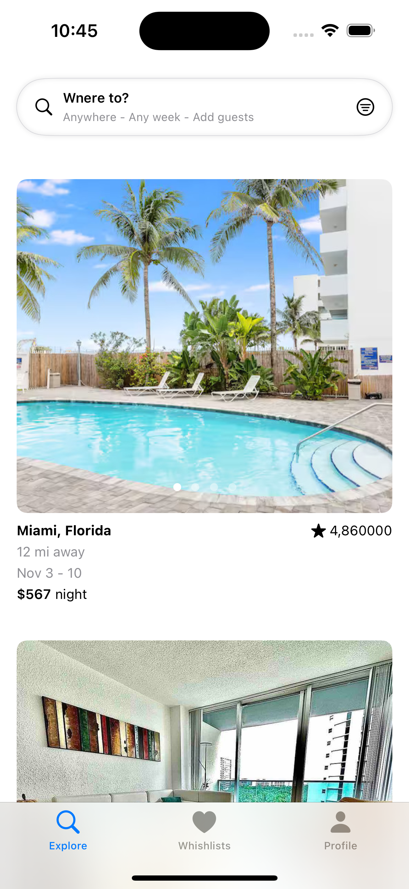
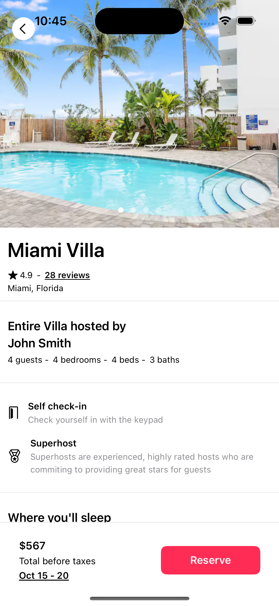
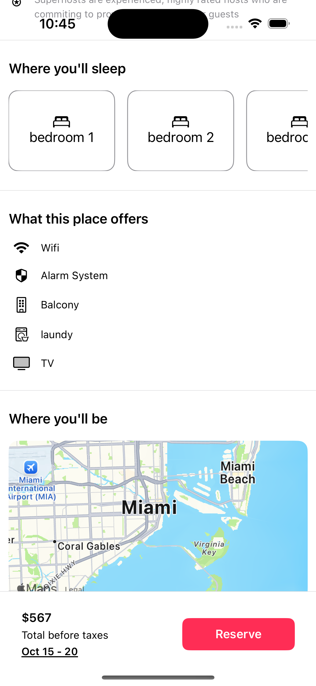
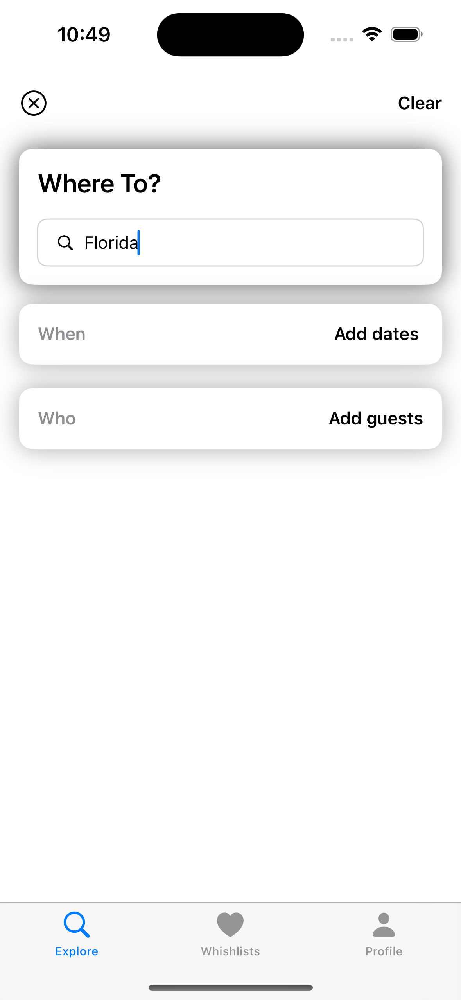
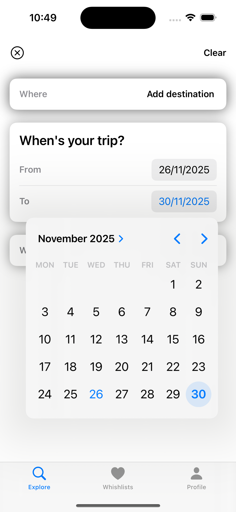
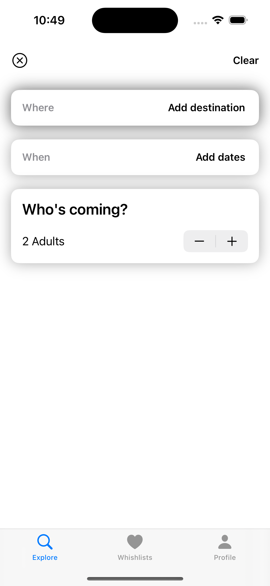
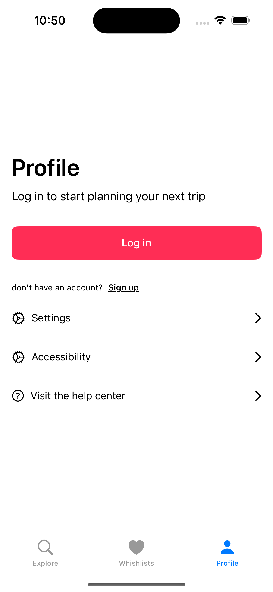
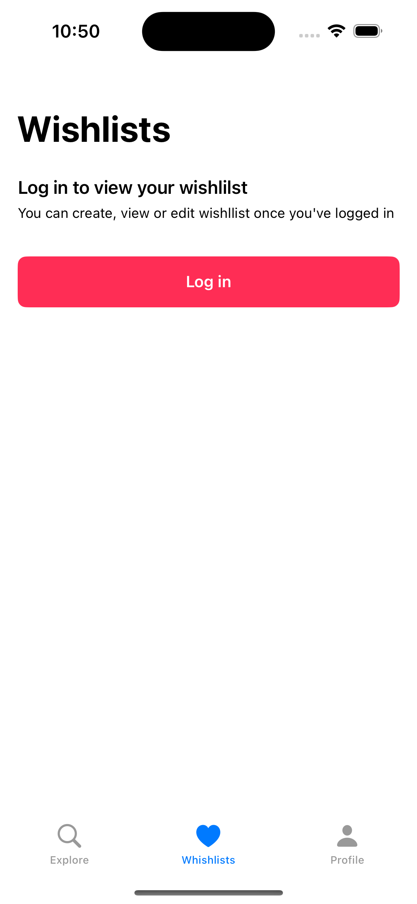

# Airbnb Clone

A SwiftUI-based clone of the Airbnb app, built as a learning project to explore modern iOS development patterns, clean architecture, and polished UI design. This project follows real Airbnb interaction flows: browsing listings, viewing property details, exploring locations, and searching dynamically.

## Features Implemented

### Core Features
- Property Listings: Clean list UI displaying photos, price, rating, and location.

- Property Details: Full listing details including description, host info, and amenities.

- Dynamic Search: Search by location, region, and property type.

- Map Integration: Browse listings on an interactive map.

- Reusable Components: Built using modular, maintainable SwiftUI components.
  
## Tech Stack

SwiftUI

MVVM Architecture

MapKit

AsyncImage / Cached Images

NavigationStack

Reusable Components

iOS 18-ready architecture

## Screenshots

### Home

### Listings

### Search

### Profile

### Wishlist

